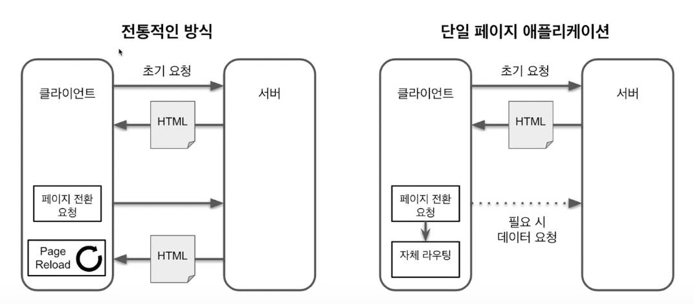

리액트 실전 프로그래밍

## 1. 리액트 프로젝트 시작하기

### 	- 리액트란 무엇인가

* 자동으로 업데이트 되는 UI 기능만 제공

  따라서 전역 관리 상태나 라우팅, 빌드 시스템을 직접 구축해야함

* render 함수는 순수 함수로 작성

  순수 함수의 특징 입력값이 같으면 출력값이 같다.

  랜덤 함수, 날짜 함수 사용(x)

  외부 상태 변경(x)

* state는 불변 변수로 관리

  어떤 객체의 속성을 변경할 경우, 새로운 객체를 만들어서 값을 할당하는 것이다.

  => 순수 함수와 불변 변수를 활용하면 복잡도가 낮아지고 버그가 발생할 확률도 적다. 리액트의 경우 렌더링 속도도 향상 시킬 수 있는 장점이 있음

### 바벨 사용해 보기

* 자바스크립트 코드를 변환해 주는 컴파일러
* 최신 자바스크립트 문법을 지원하지 않는 환경에서도 최신 문법 사용 가능
* 그 외에도 다양한 용도로 사용
  * 코드에서 주석을 제거 or 코드를 압축
* 리액트에서는 JSX 문법을 사용하기 위해 바벨을 사용한다.

### 웹팩 사용해 보기

* 다양한 기능 제공
  * 파일 내용을 기반으로 파일 이름에 해시값 추가 => 효율적으로 브라우저 캐싱 이용
  * 사용되지 않는 코드 제거
  * 자바스크립트 압축
  * JS에서 CSS, JSON, 텍스트 파일 등을 일반 모듈처럼 불러오기
  * 환경 변수 주입
* 웹팩을 사용하는 가장 큰 이유
  => 모듈 시스템(ESM, commonJS)을 사용하고 싶어서
  * ESM : ES6에서 추가됨
  * c    ommonJS : Node에서 주로 사용

* 요즘 브라우저는 ESM을 지원한다. 하지만..
  * 오래된 브라우저도 지원해야 하는 문제
  * 많은 오픈 소스가 commonJS로 작성됨 => 요즘 브라우저는 commonJS 처리를 못하기 때문에 어쩔 수 없이 웹팩을 사용해야함.


* 실제로 불러오는 모습을 network에서 확인할 수 있다.


### create-react-app으로 시작하기

* 리액트 개발 환경을 직접 구축하기 위해 필요한 노력
  * Webpack, Babel : 빌드 시스템 구축
  * Jest : 테스트 환경 구축
  * Eslint : 코딩 컨벤션 자동 체크
  * Polyfill : 오래된 브라우저를 위한 스크립트 변환
  * HMR : Vue의 핫 리로딩과 같은 기능 (Hot Module Replacement)
  * CSS 후처리 : SASS를 사용할 경우 CSS 컴파일 과정이 필요한 것 또는 오래된 브라우저를 지원하기 위해 벤더 접두사


* cra(create-react-app)을 통해 만들 경우 단점
  * SSR을 쓸 수 없다.
  * 바벨, 웹팩, eslint 등의 설정을 변경할 수 없다.


* index.js - serviceWorker : PWA 사용할 시에 필요
  * serviceWorker.unregister() -> serviceWorker.register()


* App.js에서 로고 img를 자바스크립트에서 import해서 src에 입력을 해주고 있다.

  WHY => CSS나 img 파일을 이와 같은 방식으로 사용할 경우 이미지 경로에 해시 값이 들어가 브라우저 캐싱을 효율적으로 활용할 수 있기 때문


* data의 경우 json파일로 관리할 수 있는데 너무 큰 파일일 때 미리 import해서 무작정 받아오고 보여주는 것이 아니라 필요할 때 받아오게 할 수 있다

  HOW => 클릭되었거나 어떠한 이벤트를 기점으로 import하여 데이터를 클라이언트단에 보여주도록 함

  ```react
  function App() {
    function onClick() {
      import('.data.json').then(({ default: data}) => {
        console.log({ data });
      });
    }
  	return (
    	<button onClick={onClick}>데이터 보여주세요</button>
    )
  }
  ```


### create-react-app으로 시작하기 (2)

* __Package.json 명령어 살펴보기__ 

  * react-scripts start : 개발용, https로 실행시키고 싶다면 `HTTPS=true npm start`

    (Window OS의 경우, `set HTTPS=true && npm start`)

  * react-scripts build : 배포 시 사용, 정적 파일이 생성됨

    로컬에서 정적 파일을 서비스 하고 싶다면 `npx serve -s build` build 폴더를 대상으로 함.

    큰 사이즈의 이미지는 media 폴더에 생성이 되고 작은 사이지의 이미지는 별도 파일로 생성되지 않고 js 파일 안에 내장된다.

  * react-scripts test

    `.spec.js` 또는 `.test.js`면 테스트 파일로 인식, `__test__` 폴더 밑에 있을 경우어떤 이름이든 테스트 파일로 인식

    (개인 의견) 폴더 밑에 .test.js로 붙어있으면 여러모로 관리하기 편함

    WHY => 해당 폴더 내에 있는 기능을 테스트 하는 파일이기에 좋기 때문이라 추측

  * react-scripts eject

    모든 설정 파일을 추출하는 명령어, CRA를 기반으로 직접 개발환경을 구축한다면 사 

* __Polyfill 에 대해__
  * 쓰고자 하는 기능 caniuse.com에서 브라우저 지원 범위 확인
  * Core-js Github에서 해당 기능 경로에 대해 확인
  * CRA의 경우 기본적으로 core-js가 내장되어 있음

* __환경 변수__

  process.env.{변수 이름}

  cra에선 process.env.NODE_ENV 라는 환경변수를 갖고 있음

  실행 명령어에 따라 다르게 읽어옴

  npm start -> 'development'

  npm test -> 'test'

  npm run build -> 'production'

  process.env.REACT_APP_API_URL


### CSS 작성 방법 결정하기

* 일반적인 CSS 파일로 작성하기

  class name이 겹칠 경우 빌드 했을 때 덮어 씌워짐

* css-module로 작성하기

  import할 때 객체 형식으로 보내기 때문에 객체 형식으로 받아서 클래스명을 속성 이름으로 입력해주면 된다.

  객체 안에 속성값을 보면 뒤에 해시 값이 붙어있어 클래스 명이 같아도 고유한 이름을 가짐.

  * classnames라는 패키지를 이용하면 객체 속성 값을 보다 편하게 작성 가능 하다 => ${}의 반복 작성을 피할 수 있음

* Sass로 작성하기

  Sass 문법에 있는 변수나 믹스인 등의 개념을 이용하면 재사용성이 높은 스타일 코드를 작성할 수 있다.

* css-in-js로 작성하기

  css 코드를 js 파일 안에서 작성하는 방식으로 동적으로 css 코드를 작성하기 쉽다.

  css만 담당하는 마크업 개발팀이 별도로 있는 회사일 경우 도입하는데 어려움을 겪을 수 있다. 개발팀원 모두가 css, js를 다룰 수 있다면 도입하기 좋다!

  

  __tagged template literals 문법__

  Styled component에 사용되었던 문법으로 값(css)을 매개변수로 받아서 실행하는 함수처럼 사용

  ```js
  // in box.js 
  // BoxCommon 이라는 div로 이루어진 컴포넌트 생성
  const BoxCommon = styled.div`
    height: 50px;
    background-color: #aaaaaa;
  `;
  
  // BoxCommon을 확장하여 또 다른 컴포넌트 생성 - (1)
  const BoxBig = styled(BoxCommon)`
    width: 200px;
  `;
  
  // BoxCommon을 확장하여 또 다른 컴포넌트 생성 - (2)
  const BoxSmall = styled(BoxCommon)`
    width: 100px;
  `;
  
  // in Button.js
  // 속성 값을 받아 동적으로 처리하기
  const ButtonCommon = styled.button`
    width: ${props => (props.isBig ? 100 : 50)}px;
    height: 30px;
    background-color: yellow;
  `;
  ```

  

### SPA 만들기



* Multi-Page Application **(MPA)**

  초기 요청과 이후 요청에도 모두 HTML 파일로 응답해줌.

* Single-Page Application **(SPA)**

  초기 요청에 HTML을 반환하고 이후 필요할 때만 데이터를 요청해서 받아오는 방식


* SPA가 가능하기 위한 조건

  1. 자바스크립트에서 브라우저로 페이지 전환 요청을 보낼 수 있다.

     (단, 브라우저는 서버로 요청을 보내지 않아야 한다. === 새로운 페이지에 대한 요청이 없다)

  2. 브라우저의 뒤로 가기와 같은 사용자의 페이지 전환 요청을 자바스크립트에서 처리할 수 있다.

     (마찬가지로, 브라우저는 서버로 요청을 보내지 않아야 한다.)

* 이 조건을 만족시켜주는 브라우저 API
  1. pushState, replaceState 함수
  2. popstate 이벤트


* useEffect
  1. 이벤트 핸들러 등록
  2. api를 호출 등 특정 시점에 부수 효과를 일으키고자 할 때 사용하는 리액트 함수


### 리액트 요소와 가상 돔

* **(1) 2-virtual-dom**

  브라우저에서 돔을 변경하는 것은 비교적 오래 걸리는 작업이다. **빠른 렌더링**을 위해 **돔 변경을 최소화**하는 것은 필수!! React는 메모리에 가상돔을 올려 놓고 이전과 이후의 가상돔을 비교하여 **변경된 부분만** 실제 돔에 반영한다.

  **실제 돔에 반영할 변경사항을 찾는 과정**을 따라가 보도록 한다!

  

* **(2) 가상 돔 이해하기**

  jsx 코드는 리액트 요소 트리로 구성된다.

  리액트에서 데이터 변경에 의한 화면 업데이트는 

  1. 렌더 단계 (가상 돔) => 실제 돔에 반영할 변경사항을 파악
  2. 커밋 단계 (실제 돔) => 파악된 변경 사항을 실제 돔에 반영

  을 거친다.

  렌더 단계 에서는 변경 사항을 파악하기 위해 **가상 돔**을 이용하는데 이는 리액트 요소로부터 만들어진다! React는 렌더링을 할 때마다 가상 돔을 만들고 이전 가상 돔과 비교를 한다. 이는 실제 돔의 변경 사항을 최소화하기 위한 과정이다.

  이번 코드를 기반으로 **리액트 요소가 실제 돔으로 만들어지는 과정**에 대해 알아보고자 한다.	


### 리액트 훅(Hook)

* 컴포넌트에 기능을 추가할 때 사용하는 함수

  ex) 컴포넌트에 상태값 추가, 자식 요소에 접근

  리액트 16.8에 새로 추가된 것으로 그 전엔 클래스형 컴포넌트를 사용했다. 클래스형 컴포넌트보다 장점이 많아 리액트 팀도 훅에 집중하고있다. (19년도 kakao con 에서 관련된 영상을 찾을 수 있다.) => 영상이 없어져 블로그 포스팅에 걸려있는 [발표 자료](https://m.blog.naver.com/PostView.naver?isHttpsRedirect=true&blogId=horajjan&logNo=221648675404)로 대체


* 대표적인 훅 두가지!

  1. useState : 상태값 추가

     ```react
     const [{상태값}, {상태값 변경 함수}] = useState({초기값});
     const [count, setCount] = useState(0);
     // 첫 번째 아이템에는 상태값, 두 번째 아이템에는 상태값 변경 함수
     ```

     * 비동기 + 배치 처리

       ```react
       function onClick() {
         setCount(count + 1);
         setCount(count + 1);
       }
       console.log('render called');
       ```

       위와 같이 짜여있는 onClick 함수가 걸려있는 버튼을 클릭하면 count가 1씩 두번 증가할 것이라 생각하지만

       실제론 한번만 증가한다.

       비동기로 처리하는 이유는 동기로 처리할 경우 하나의 상태값 변경 함수가 호출될 때마다 화면을 다시 그리기 때문에 성능상 이슈가 생길 수 있기 때문.

       만약 억지로 위와 같이 처리하고 싶다면 상태값 변경 함수에 함수를 입력해서 다음과 같이 해결할 수 있다.

       ```react
       function onClick() {
         // 처리되기 직전의 상태값을 매개변수로 받는다
         setCount(v => v + 1);
         // 아래도 마찬가지
         setCount(v => v + 1);
       }
       console.log('render called');
       ```

       배치로 처리하는 이유는 onClick 이벤트 핸들러는 리액트 내부에서 관리되는 리액트 요소에 입력이 되어 있기 때문에 배치로 처리하는 것

       만약 리액트에서 관리하지 않는 외부에서 호출하는 경우 배치로 동작하지 않음, 이러한 경우 상태값 변경 함수를 호출할 때마다 렌더링이 발생함.

       ```react
       // 외부에서 처리하여 렌더링이 발생함.
       useEffect(() => {
         window.addEventListener('click', onClick);
         return () => window.addEventListener('click', onClick);
       })
       ```

        이런 상황에서 외부에서 처리 될 때도 배치로 처리되길 원한다면 

       ```react
       function onClick() {
         // unstable_batchedUpdated라는 함수를 호출하면 된다.
         ReactDOM.unstable_batchedUpdated(() => {
           setCount(v => v + 1);
           setCount(v => v + 1);  
         })
       }
       console.log('render called');
       ```

       앞에 unstable이라는 prefix가 붙어있긴 하지만 대부분 이런식으로 사용하고

       나중에 있을 concurrent mode가 추가된다면 외부에서 호출된 함수로 배치로 동작하게 될 것

     * 순서대로 처리된다.

       

  2. useEffect : 부수효과 처리 (여기서 부수효과란 외부의 상태를 변경하는 것을 말한다)

     * 렌더링이 끝나고 항상 호출된다. (ex, 서버 api 호출, 이벤트 핸들러 등록 등에 사용)

     * 컴포넌트 렌더링 중에 부수 효과를 발생시키는 것 프로그램의 복잡도를 크게 증가시키기에 모든 부수 효과는 useEffect 안에서 처리하기를 권장 (지키지 않는다면 유닛테스트 작성하기에 힘들어지는 등 순수 함수가 가지는 여러 장점을 포기하는 것이기 때문)

     * 렌더링이 끝나고 항상 호출되기에 만약에 렌더링이 자주 발생한다면 문제가 된다. 이것을 해결하기 위해 두 번째 매개 변수인 의존성 배열을 입력함으로써 해결할 수 있다. 이 배열에 있는 값이 변경될 때만 부수 효과 함수가 실행됩니다.

       따라서, **컴포넌트의 상태값이나 속성값**, **지역 변수나 지역 함수**같은 것들은 **모두 의존성 배열에 작성**

       <u>setUser와 같은 상태값 변경 함수는 의존성 배열에 작성하지 않아도 된다.</u> 함수가 변경되지 않는다는 것이 보장되기 때문! 

       ```react
       // Profile.js
       // 빈 배열일 경우
       useEffect(() => {
         getUserApi(userId).then(data => setUser(data));
       }, []);
       // => 의존성 배열에 아무것도 담겨있지 않기에 increase 버튼을 눌러도 부수 효과 함수가 실행되지 않고
       //    그로인해 유저 객체가 바뀌지 않음
       ```

       지역 함수인 경우

       ```react
       // Profile.js
       function func1() {
         console.log(userId)
       }
       useEffect(() => {
         func1();
         getUserApi(userId).then(data => setUser(data));
       }, [useId, func1]);
       ```

       Profile 컴포넌트가 렌더링될 때마다 func1이라는 함수가 새로 생성되고 이로 인해 의존성 배열의 값이 항상 변경된다고 볼 수 있다. 이럴 때는 **useCallback** 이라는 훅을 이용해서 **메모이제이션 기능**을 이용할 수 있다.

  3. Custom Hook 만들기

     * 이름은 use로 시작하는 것이 좋다

       코드 가독성이 좋아지고,  여러 리액트 개발 도구의 도움도 쉽게 받을 수 있기 때문

       ```react
       // Profile.js
       export default function Profile({ userId }) {
         // 1. userId가 바뀔 경우
         // 커스텀 훅(useUser) 내부에서 자동으로 api를 호출해서 사용자 데이터를 가져오고
         // 3. 그로인해 컴포넌트도 같이 새로운 유저 정보와 함께 렌더링 된다.
         const user = useUser(userId);
         return (
           <div>
             {!user && <p>사용자 정보를 가져오는 중...</p>}
             {user && (
               <>
                 <p>{`name is ${user.name}`}</p>
                 <p>{`age is ${user.age}`}</p>
               </>
             )}
           </div>
         );
       }
       
       
       // useUser.js
       export default function useUser(userId) {
         // 2. 그로 인해 내부 상태값인 user가 변경된다.
         const [user, setUser] = useState(null);
           useEffect(() => {
             getUserApi(userId).then(data => setUser(data));
           }, [userId]);
         return user;
       }
       ```

       

